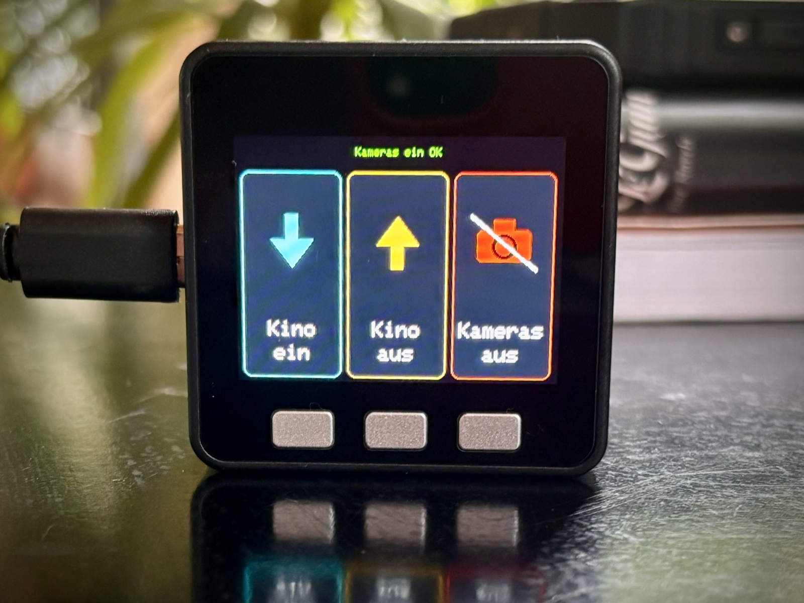

# m5stack-ha-button
### A physical three-button controller for Home Assistant — cinema screen and camera privacy, no phone required


<p align="center">
  
</p>

---

## ✨ Quick Start (2 minutes)

```bash
cp include/secrets.h.example include/secrets.h
# fill in WiFi + Home Assistant details in secrets.h
pio run --target upload --upload-port /dev/cu.usbserial-XXXXXXXXXX
```

➡️ That's it.
Three glowing cards light up on the screen, ready to fire.

---

## 🧠 Concept

One box, three buttons, one job each:

- **Cinema on** — lower the projector screen
- **Cinema off** — raise it again
- **Cameras off / on** — kill (and later restore) the Tapo + Eufy cameras,
  for whenever privacy matters more than surveillance

The device itself knows nothing about your cameras, your screen, or how any
of that actually works. It only knows three webhook URLs. All real logic
(which switch flips, which script runs, what gets announced over TTS) lives
entirely in Home Assistant, where it's easy to change without ever touching
the firmware again.

That split also keeps the ESP32's blast radius small: no API token, no
credentials beyond WiFi — just three unauthenticated, `local_only` webhook
IDs that can each trigger exactly one automation and nothing else.

---

## 🏗️ Architecture

```
+----------------------------------+
| M5Stack Basic Core (ESP32)       |
|-----------------------------------|
| 3 physical buttons                |
| Card UI (M5Unified / M5GFX)       |
| WiFi + HTTP POST                  |
+------------------+----------------+
                   |
                   | POST /api/webhook/<id>  (local_only)
                   v
+----------------------------------+
| Home Assistant                    |
|-----------------------------------|
| Automation (webhook trigger)      |
|   -> Script                       |
|      -> switch.turn_on/off        |
|      -> tts.speak                 |
|      -> persistent_notification   |
+----------------------------------+
```

---

## 🧩 Buttons

| Button | Action | Behavior |
|---|---|---|
| **A** | Cinema on | Hold ~1.5s (progress bar fills) — guards against bumping it by accident |
| **B** | Cinema off | Single press |
| **C** | Cameras off / on | Single press, toggles — card always shows the next available action |

A 2.5s cooldown after every trigger prevents accidental double-fires, and
each card flashes green/red for 2s to confirm success or failure.

---

## 🔧 Setup

### 1. Firmware

Requires [PlatformIO](https://platformio.org/) (`brew install platformio`).

```bash
cp include/secrets.h.example include/secrets.h
```

Fill in `include/secrets.h` with your WiFi credentials, Home Assistant base
URL, and webhook IDs. This file is gitignored and never committed.

```bash
pio run --target upload --upload-port /dev/cu.usbserial-XXXXXXXXXX
```

### 2. Home Assistant

Each button needs an automation with a `webhook` trigger that runs your
actual logic. Reference configs are in [`homeassistant/`](homeassistant):

- **Cinema on / off** — add the webhook trigger from
  `cinema_on_off_webhooks.yaml` to your existing automations.
- **Cameras off / on** — create the script + wrapper automation from
  `kameras_aus.yaml` / `kameras_ein.yaml`, adjusted to your own camera switch
  entity IDs.

All webhook triggers use `local_only: true` — they only accept requests from
your local network, nothing is exposed to the internet.

### 3. Battery-powered Eufy cameras

These need the `eufy_security` HACS integration, which in turn needs a
separate `eufy-security-ws` server (talks P2P to the Eufy homebase). Docker
Compose template: [`homeassistant/eufy-security-ws/docker-compose.yaml`](homeassistant/eufy-security-ws/docker-compose.yaml).

```bash
mkdir -p /opt/eufy-security-ws/data
# copy docker-compose.yaml there, fill in USERNAME/PASSWORD/COUNTRY
cd /opt/eufy-security-ws && docker compose up -d
```

### 4. Tapo camera

Switched via a plain smart plug (Kasa/Tapo) instead of a camera-specific
integration — far more reliable than the cloud-auth-based Tapo camera
integrations.

---

## ⚠️ Known limitations

- The on/off state shown on the "Cameras" card is tracked **locally on the
  device**, not read back from Home Assistant (deliberately, to avoid
  needing an API token on the device). If the cameras are toggled some other
  way (app, HA dashboard), the card label may be briefly wrong until the
  next press — the webhook it actually fires is unaffected.
- On boot, the device assumes cameras are currently on (shows "Cameras off"
  as the next action).
